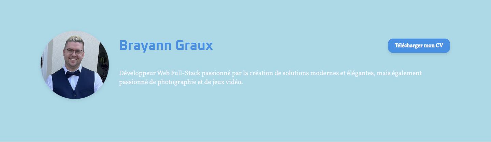
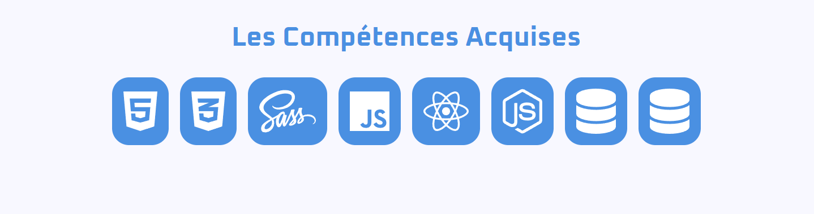
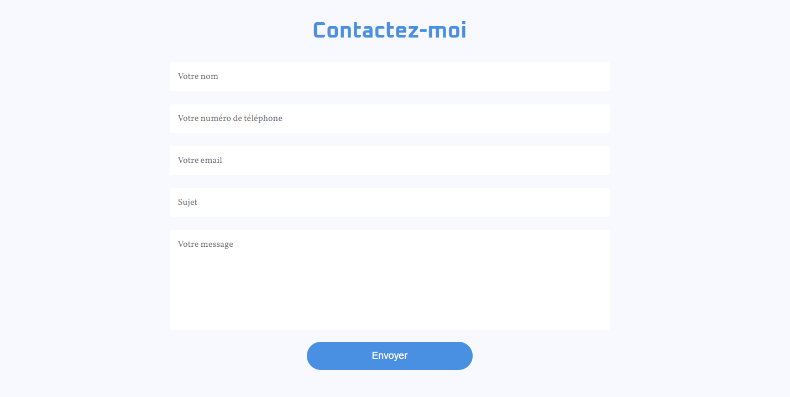

# Mon Portfolio De Développeur

Ce proejt a pour but de me preparer a la recherche d'emploi de développeur, et pouvoir egalement faire un bilan de mes competence acquise lors de la formation.

Egalement le site créer lors de ce projet, va etre de pouvoir mettre en ligne celui-ci comme portfolio.

## Les Differente Partie Du Site

### La NavBar

### Le Profile

### La Navbar format burger

### Les Skills (Compétences)

### Les Projet

### La Fiche Contact

### Le Copyright
